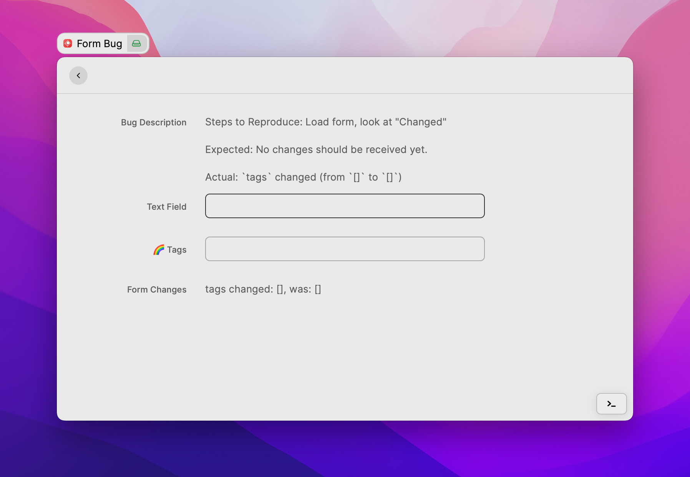

# Form.TagPicker Bug

Simple example for showing a bug in Form.TagPicker

## Bug Description

Setup: `npm install && npm run dev`

Steps to reproduce: Run "Form Bug" command, observe `Changed` detail view.

Expected: No fields should be marked as `changed`.

Actual: `tags` is marked as changed (from `[]` to `[]`).
